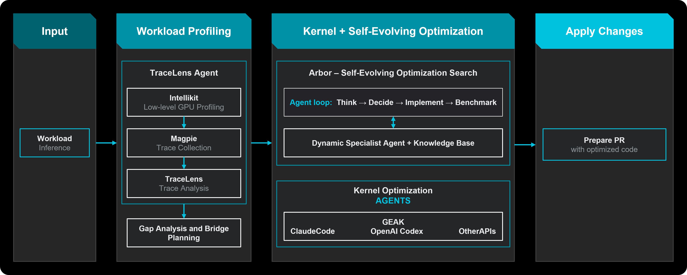

# ROCm Hyperloom

[](https://github.com/AMD-AGI/Hyperloom/actions/workflows/tests-coverage.yml)
[](https://github.com/AMD-AGI/Hyperloom/actions/workflows/lint.yml)
[](pyproject.toml)
[](LICENSE)
[](pyproject.toml)

ROCm™ Hyperloom is an autonomous agentic system designed to optimize end-to-end inference workloads
(targeting both host code and GPU kernels) on AMD GPUs. Using advanced AI agents and profiling tools,
Hyperloom analyzes your workload, identifies performance bottlenecks, implements targeted optimizations,
and validates the performance and correctness of the optimizations without requiring manual intervention.

### Supported GPUs

| GPU Family | Models | Notes |
|------------|--------|-------|
| Instinct MI300 | MI300X, MI308X, MI325X | CDNA3, ROCm native |
| Instinct MI350 | MI355X | CDNA4, ROCm native |
| Radeon RX 9000 series | RX 9070 XT, RX 9070, RX 9060 XT, RX 9000 XT | RDNA4 WMMA FP8 support, Windows ROCm 7.3+ |

The system operates through a sophisticated multi-stage pipeline. First TraceLens, the profiling brain of
the workload understanding stage, consumes traces collected by Magpie (which in turn relies on IntelliKit
for some low-level GPU profiling tools), captures bottlenecks, and derives the roofline targets that seed
the optimization search tree.

Next, Hyperloom employs a self-evolving code optimization engine following an iterative agentic loop (Think
→ Decide → Implement → Benchmark). Arbor intelligently explores the optimization space using a Dynamic
Specialist Agent and Knowledge Base. In parallel to Arbor, GEAK, a multi-agent GPU performance optimizer,
optimizes hot kernels. Once optimizations are identified and validated, Hyperloom prepares
the optimized code and generates a report with all proposed changes and expected performance improvements.
This end-to-end automation enables developers to achieve significant performance improvements while
maintaining code quality and reducing the manual effort traditionally required for GPU optimization.

<p align="center"></p>

Hyperloom combines:

- Trace analysis, identifying bottleneck kernels and bridge planning through
  [TraceLens](https://github.com/AMD-AGI/TraceLens) Agent (backend support
   from [Magpie](https://github.com/AMD-AGI/Magpie) and
   [Intellikit](https://github.com/AMDResearch/intellikit))
- Kernel optimization through the
  [GEAK](https://github.com/AMD-AGI/GEAK) backend.
- Agentic search space exploration through
  [Arbor](https://arxiv.org/abs/2606.12563), a tree-based cognition layer
  with dynamic agents, long-horizon campaigns, and self-evolving optimization
  guided by a curated knowledge base of hardware learnings, pitfalls, and
  prior campaign artifacts.

## Get Started

| Goal | Guide |
|------|-------|
| Set up Hyperloom and run a demo | [Quickstart](examples/README.md) |
| Launch and monitor an optimization | [Run an optimization](docs/how-to/optimize.md) |
| Understand the algorithm | [Optimization loop](docs/conceptual/optimization-loop.md) |

## Documentation

| Topic | Link |
|-------|------|
| ROCm Docs | [Hyperloom](https://rocm.docs.amd.com/projects/hyperloom/en/latest/index.html) |
| Authentication and credentials | [Authentication & credentials](docs/reference/authentication.md) |
| Environment variables | [Environment variables](docs/reference/environment-variables.md) |
| Components | [Components](docs/components/index.md) |
| Compatibility | [Compatibility matrix](docs/compatibility.rst) |
| Troubleshooting | [Troubleshooting](docs/reference/troubleshooting.md) |
| Operations | [Operations & self-hosting](docs/reference/operations.md) |
| Session output schema | [`session_breakdown.json`](docs/reference/session-breakdown.md) |
| Vulkan LLM engine (architecture) | [`docs/VULKAN-LLM-ENGINE-ARCHITECTURE.md`](docs/VULKAN-LLM-ENGINE-ARCHITECTURE.md) |
| Vulkan LLM engine (implementation) | [`docs/VULKAN-LLM-ENGINE-IMPLEMENTATION.md`](docs/VULKAN-LLM-ENGINE-IMPLEMENTATION.md) |
| Vulkan compute shader spec | [`docs/VULKAN-COMPUTE-SHADER-SPEC.md`](docs/VULKAN-COMPUTE-SHADER-SPEC.md) |
| LLM engine full-system | [`docs/LLM-ENGINE-FULL-SYSTEM-ARCHITECTURE.md`](docs/LLM-ENGINE-FULL-SYSTEM-ARCHITECTURE.md) |

## Architecture Porting

The analysis tooling ships architecture profiles for RDNA1–RDNA4. Porting to a
new AMD generation (or tuning an existing one) touches two places:

1. **`tools/analyze.py`** — `ARCH_PROFILES` (CU count, wave size, SIMD/LDS/L2)
   plus a `KERNEL_DB_*` block for arch-specific kernel shapes.
2. **`tools/detect.py`** — `_classify_gpu_architecture()` maps GPU name →
   `gfxNNNN` target.

```bash
python aicompass.py analyze trace.csv --arch rdna4
python aicompass.py detect
```

The tooling is backend-agnostic by design — the same trace-analysis pipeline
reads HIP (ROCm), Vulkan, and DirectX-instrumented workloads, so the profiles
port across architectures and APIs without touching the analyzer core.

## File Issues and Feedback

If you encounter any problem or bugs while running Hyperloom, feel free to open an
[issue](https://github.com/AMD-AGI/Hyperloom/issues/new/choose), or provide us with
feedback on how to improve Hyperloom by completing the
[beta survey](https://www.feedback.amd.com/se/5A1E27D2004A9E15).

---

## Developer Entry Points

- Runtime package: `src/hyperloom/`
- Main agent instructions: [`src/hyperloom/inference_optimizer/SKILL.md`](src/hyperloom/inference_optimizer/SKILL.md)
- CLI entry point: `python -m hyperloom.inference_optimizer.cli optimize`
- Operator tools: `python -m hyperloom.inference_optimizer.tools.*`
- Unified AI-COMPASS CLI: `python aicompass.py status` (toolkits, Vulkan engine, memory)
- Documentation source: `docs/`

For contribution workflow, testing, and linting, see
[`CONTRIBUTING.md`](CONTRIBUTING.md).

---

## Vulkan LLM Engine (rdna4-llm)

A Vulkan-compute LLM inference engine in `src/rdna4-llm-legacy/` (ported
reference) and `src/rdna4-llm/` (current build). GLSL compute shaders compiled
to SPIR-V at build time; wave32/64 variants generated per kernel.

**Requirements:** Windows, Vulkan SDK (`C:\VulkanSDK` or `VULKAN_SDK` env),
MSVC + Windows SDK. CMake pins the SDK version in `CMakeLists.txt`.

**Build:**
```
# legacy reference engine (PowerShell script, MSVC + glslc)
cd src/rdna4-llm-legacy && .\build.ps1 -Release

# current engine (CMake)
cmake -B src/rdna4-llm/build -S src/rdna4-llm
cmake --build src/rdna4-llm/build --config Release
```

**Shaders:** `shaders/*.comp` (GLSL), per-quant (`fp16`, `q4_k`, `q6_k`,
`q8_0`, `iq4_xs`) x kernel (attn, ffn, lm_head, rope, norm). Generated wave
variants land in `build/generated/*_w32.h` / `*_w64.h` via
`scripts/embed_spirv.py`.

**Docs:** `docs/VULKAN-LLM-ENGINE-ARCHITECTURE.md`,
`docs/VULKAN-LLM-ENGINE-IMPLEMENTATION.md`, `docs/VULKAN-COMPUTE-SHADER-SPEC.md`.

## Third-party / vendored components

| Path | What | Usage |
|------|------|-------|
| `third_party/vma/vk_mem_alloc.h` | Vulkan Memory Allocator (header-only) | used by rdna4-llm buffer allocation |
| `src/rdna4-llm/third_party/vma/` | VMA copy for current engine | same |
| `vendor/agentreach/` | Agent Reach v1.5.0 (internet capability layer) | `python aicompass.py agentreach` or `agent-reach` |
| `vendor/<toolkit>/` | GEAK, Hyperloom, Magpie, TraceLens, intellikit, Apex | surfaced by `python aicompass.py status` |

All vendored code is unmodified upstream, MIT-licensed, and never re-implemented
here. The AMD Radeon Developer Tool Suite (`RadeonDeveloperToolSuite-*/`) is a
manual download — gitignored, never synced to git.

---

## Acknowledgments

This repo vendors **[Agent Reach](https://github.com/Panniantong/Agent-Reach)**
(v1.5.0, MIT) in `vendor/agentreach/` to give AI agents internet access
(Twitter, Reddit, YouTube, Bilibili, XiaoHongShu, GitHub, RSS, web search, and
more) via the `agent-reach` CLI. Agent Reach is built and maintained by
**Panniantong** ([@Panniantong](https://github.com/Panniantong));
agent-reach CLI install instructions and usage live in its own repository.
The vendored source is unmodified upstream code.

---

## Licensing

Hyperloom is released under the **MIT License**. The full license text
is in [`LICENSE`](LICENSE).

You may use Hyperloom commercially, modify it, and distribute it under
the terms of the MIT license, provided the copyright notice and the
permission notice are retained in all copies or substantial portions of
the software.

Third-party tools and agents (Cursor, Visual Studio, and Claude Code)
that Hyperloom invokes are governed by their own separate license terms
and are NOT covered by the MIT license above — see the "Third-Party
Tools and Agents" section in [`LICENSE`](LICENSE). You are responsible
for reviewing and complying with each tool's individual license.

For security-relevant issues, see [`SECURITY.md`](SECURITY.md). For
contribution conventions, see [`CONTRIBUTING.md`](CONTRIBUTING.md).